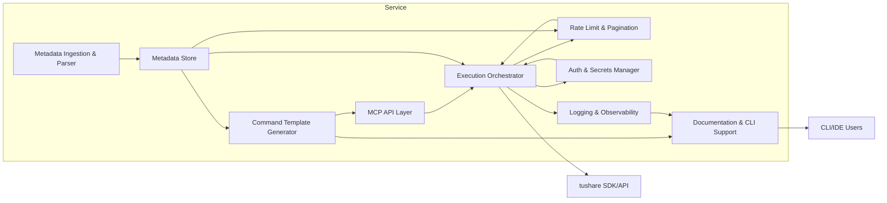
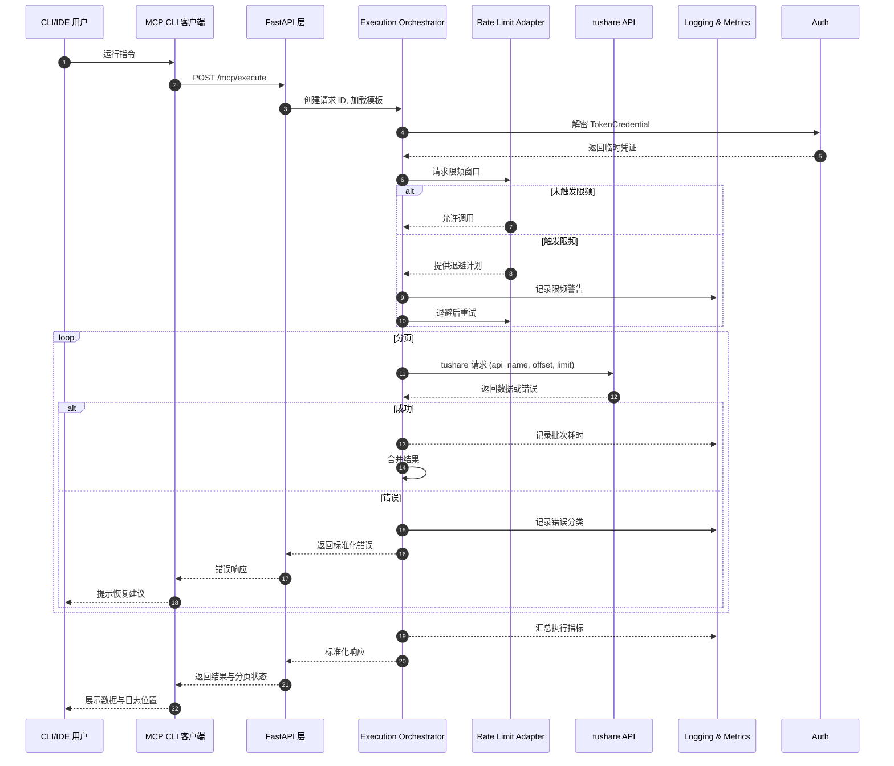

# tushare MCP Service Architecture Document

## Introduction

`tushare MCP Service` 的后端架构文档旨在为 AI 驱动的开发团队提供统一蓝图，指导如何解析 tushare SDK 元数据、封装 MCP 指令并通过 CLI/REST 暴露给量化分析师。方案以分层单体架构为核心，聚焦元数据管线、认证安全、分页限频处理以及观测性，确保满足 PRD 中的业务目标与非功能约束。

### Starter Template or Existing Project
- 项目为绿地（Greenfield），基于 Monorepo 自建结构（`metadata/`、`mcp_commands/`、`service/`、`docs/`）。
- 推荐结合 FastAPI 官方脚手架及 Cookiecutter 作为初始化参考，以加速目录、依赖与测试框架搭建；随后为元数据与 MCP 模块补充自定义结构。
- 如选择完全手工搭建，则需额外投入配置时间，但不影响后续架构设计。

### Change Log
| Date       | Version | Description                         | Author  |
|------------|---------|-------------------------------------|---------|
| 2025-09-29 | v0.1    | 创建 tushare MCP 后端架构文档初稿 | Winston |

## High Level Architecture

### Technical Summary
`tushare MCP Service` 采用分层单体架构，FastAPI/uvicorn 作为入口，将业务拆分为元数据管线、指令生成、调用代理与观测性模块。核心流程包括解析 tushare SDK、批量生成 MCP 指令、在运行时协调限频分页与日志记录，并统一返回结构化响应。该架构与 PRD 中的 Monorepo、Python 技术假设一致，确保在单体内高效协作并为后续扩展提供清晰边界。

### High Level Overview
- **架构风格：** 分层单体结构，内部按“元数据 → 指令生成 → 调用代理 → 观测性”划分，满足快速迭代需求。
- **仓库结构：** Monorepo，目录涵盖 `metadata/`、`mcp_commands/`、`service/`、`docs/` 等，便于统一管理。
- **服务架构决策：** 单体内部模块化，减少微服务带来的运维复杂度，并保留未来拆分空间。
- **主要数据流：** CLI/IDE 用户发起请求 → 认证模块解密 Token → 调用代理执行 tushare → 限频/分页策略保障稳定 → 日志与监控记录指标 → 返回标准化响应。
- **关键决策：** 选用 FastAPI + Python 3.11 以获得类型化与 async 体验；使用 SQLite/JSON 起步，未来平滑升级 PostgreSQL；统一日志/监控钩子满足可观测性要求。

### High Level Project Diagram
```mermaid
graph TD
    subgraph CLI/IDE Client
        UserRequests
    end

    subgraph MCP Backend (FastAPI Monolith)
        Auth[Auth & Secrets Manager]
        MetadataRepo[Metadata Repository]
        CmdGenerator[MCP Command Generator]
        Orchestrator[Execution Orchestrator]
        Pagination[Pagination & Rate Limit Adapter]
        Logger[Logging & Metrics]
    end

    Tushare[tushare SDK & API]
    Storage[(SQLite/JSON Metadata Store)]
    MetricsSink[(Observability / Metrics Exporter)]

    UserRequests --> Auth
    Auth --> Orchestrator
    Orchestrator --> MetadataRepo
    MetadataRepo --> CmdGenerator
    CmdGenerator --> Orchestrator
    Orchestrator --> Pagination
    Pagination --> Tushare
    Tushare --> Pagination
    Pagination --> Orchestrator
    Orchestrator --> Logger
    Logger --> MetricsSink
    MetadataRepo --> Storage
    Storage --> MetadataRepo
```

### Architectural and Design Patterns
- **分层架构 (Layered Architecture)：** 在单体内按表示层、应用层、领域层、基础设施层划分，保证职责清晰。
- **仓储模式 (Repository Pattern)：** 为元数据、指令配置与日志提供数据访问抽象，便于迁移不同存储。
- **命令模式 + 模板方法：** MCP 指令生成与执行代理通过命令对象和模板流程保持一致性。
- **重试与限频策略：** 结合指数量身定制的退避算法与熔断机制，提升高频调用稳定性。
- **请求追踪 (Correlation ID)：** 全链路保留请求 ID，支持日志与响应对齐，便于排障。

## Tech Stack

### Cloud Infrastructure
- **自托管（推荐）：** macOS/Linux 本地部署 + Docker 化，后续可迁移至 Kubernetes。
- **AWS（备选）：** EKS/Lambda + API Gateway，享受托管监控与 Secrets Manager。
- **阿里云（备选）：** ACK 或函数计算，贴近国内量化团队习惯。

### Technology Selection Table
| Category           | Technology                | Version    | Purpose                                   | Rationale |
|--------------------|---------------------------|------------|-------------------------------------------|-----------|
| Language           | Python                    | 3.11.8     | 后端主语言                               | 性能提升、兼容 tushare SDK |
| Runtime            | uvicorn + gunicorn        | 0.30 / 22.0| 异步服务运行时                           | 多进程 + asyncio 保证吞吐 |
| Web Framework      | FastAPI                   | 0.111      | 构建 REST API 与校验                      | 类型提示友好、async 支持强 |
| Async Toolkit      | anyio                     | 4.x        | 协程协调                                 | 提供统一异步接口 |
| Storage            | SQLite (MVP) / PostgreSQL | 3.45 / 16  | 元数据与日志存储                         | 轻量起步，可平滑升级 |
| ORM                | SQLModel                  | 0.0.16     | 数据层抽象                               | 结合 Pydantic 与 SQLAlchemy |
| HTTP 客户端        | httpx                     | 0.27       | tushare 调用                             | 支持 async/同步双模式 |
| Validation         | Pydantic                  | 2.8        | 模型验证与序列化                         | 与 FastAPI 深度集成 |
| Authentication     | cryptography (Fernet)     | 42.x       | Token 加密                               | 满足本地安全需求 |
| Logging            | structlog + OpenTelemetry | 24.1 / 1.25| 结构化日志与指标                         | 满足观测性与追踪需求 |
| Testing            | pytest + pytest-asyncio   | 8.3 / 0.23 | 单元与集成测试                           | 覆盖 async 场景 |
| CLI 框架           | Typer                     | 0.12       | 构建命令行工具                           | 简洁、类型安全 |
| 文档生成           | MkDocs + material         | 1.6        | 指令文档与架构文档                       | 易于发布与维护 |
| 容器化             | Docker + docker-compose   | 27 / 2.28  | 本地与 PoC 部署                         | 社区成熟、易于协作 |

## Data Models

### `DataSource`
- **Purpose:** 描述 tushare 数据源、认证、限频策略。
- **Key Attributes:** `source_id`, `name`, `rate_limit`, `auth_required`。
- **Relationships:** 1 对多 `InterfaceMetadata`、1 对多 `RateLimitPolicy`（逻辑层面）。

### `InterfaceMetadata`
- **Purpose:** 存储接口参数、字段、频率描述，为 MCP 指令生成提供核心输入。
- **Key Attributes:** `interface_name`, `parameters`, `response_fields`, `throttle_hint`。
- **Relationships:** 多对一 `DataSource`; 一对多 `CommandTemplate`; 一对多 `FieldAliasRule`。

### `CommandTemplate`
- **Purpose:** 表示基于元数据生成的 MCP 指令模板。
- **Key Attributes:** `command_id`, `metadata_ref`, `parameter_schema`, `execution_profile`。
- **Relationships:** 多对一 `InterfaceMetadata`; 一对多 `CommandVersion`; 一对多 `ExecutionLog`。

### `ExecutionLog`
- **Purpose:** 记录每次执行的上下文、耗时、重试和错误信息。
- **Key Attributes:** `request_id`, `command_id`, `status`, `retry_count`, `duration_ms`, `error_payload`。
- **Relationships:** 多对一 `CommandTemplate`; 多对一 `TokenCredential`。

### `TokenCredential`
- **Purpose:** 管理 tushare Token 的加密存储、轮换与审计。
- **Key Attributes:** `credential_id`, `encrypted_token`, `salt`, `last_rotated_at`, `owner`。
- **Relationships:** 一对多 `ExecutionLog`; 一对多 `CredentialAudit`。

## Components

### Metadata Ingestion & Parser
- **Responsibility:** 解析 tushare SDK/文档，输出结构化元数据。
- **Key Interfaces:** `parse_sdk_interface()`, `refresh_metadata_cache()`。
- **Dependencies:** `Metadata Store`, `Field Alias Rules`。
- **Technology Stack:** Python 3.11, SQLModel, 校验脚本。

### Metadata Store
- **Responsibility:** 存储/版本化接口元数据与限频策略。
- **Key Interfaces:** `get_interface_metadata()`, `save_metadata()`。
- **Dependencies:** SQLite/SQLModel/Alembic。
- **Technology Stack:** SQLite 3.45 → PostgreSQL 16。

### Command Template Generator
- **Responsibility:** 基于元数据生成 MCP 指令文件与文档。
- **Key Interfaces:** `generate_command_template()`, `bulk_generate_templates()`。
- **Dependencies:** `Metadata Store`, Jinja2。
- **Technology Stack:** Python, Jinja2, Pydantic。

### MCP API Layer (FastAPI)
- **Responsibility:** 暴露 REST/CLI 接口，执行参数验证与响应格式化。
- **Key Interfaces:** `POST /mcp/execute`, `GET /mcp/commands`, `POST /auth/token`。
- **Dependencies:** `Auth & Secrets Manager`, `Execution Orchestrator`。
- **Technology Stack:** FastAPI, uvicorn, httpx。

### Execution Orchestrator
- **Responsibility:** 调度 tushare 调用，协调分页、限频、重试。
- **Key Interfaces:** `execute_command()`, `with_retry()`。
- **Dependencies:** `Command Template Store`, `Rate Limit Adapter`, `TokenCredential`, `Logging`。
- **Technology Stack:** Python asyncio, anyio。

### Rate Limit & Pagination Adapter
- **Responsibility:** 执行限频窗口管理、重试退避与分页遍历。
- **Key Interfaces:** `paginate_fetch()`, `enforce_rate_limit()`。
- **Dependencies:** `Execution Orchestrator`, `Metadata Store`。
- **Technology Stack:** 自研算法模块。

### Auth & Secrets Manager
- **Responsibility:** 加密/解密 tushare Token，提供轮换与审计。
- **Key Interfaces:** `store_token()`, `get_token()`, `rotate_token()`。
- **Dependencies:** `TokenCredential`, `cryptography`。
- **Technology Stack:** cryptography (Fernet), python-dotenv。

### Logging & Observability
- **Responsibility:** 记录结构化日志、导出指标。
- **Key Interfaces:** `log_execution()`, `emit_metrics()`。
- **Dependencies:** structlog, OpenTelemetry。
- **Technology Stack:** structlog 24.1, OTEL 1.25。

### Documentation & CLI Support
- **Responsibility:** 生成指令文档、提供 Typer CLI。
- **Key Interfaces:** `generate_docs_from_templates()`, CLI 命令 `list/describe/exec`。
- **Dependencies:** `Command Template Generator`, MkDocs, Typer。

### Component Diagram


## External APIs
- **Purpose:** tushare 官方 API，提供行情、财务等数据。
- **Documentation:** https://tushare.pro/document/2
- **Base URL(s):** `https://api.tushare.pro`
- **Authentication:** Header `{"token": "<user_token>"}`，由 `Auth & Secrets Manager` 注入。
- **Rate Limits:** 单 Token 每分钟约 200 次调用；需结合接口公告调整。
- **Key Endpoints:** `daily_basic`, `income`, `stock_basic`, `trade_cal`（全部通过 POST `/` 调用）。
- **Integration Notes:** 统一请求格式，需处理分页参数、错误码映射、限频退避；响应为 `fields` + `items` 结构。

## Core Workflows

### 执行 MCP 指令获取行情数据


## REST API Spec
```yaml
openapi: 3.0.0
info:
  title: tushare MCP Backend API
  version: 0.1.0
  description: 提供 MCP 指令执行与元数据访问能力的统一后端接口。
servers:
  - url: http://localhost:8000
    description: 本地开发环境
  - url: https://mcp.example.com
    description: 预留生产入口（待部署）
paths:
  /mcp/commands:
    get:
      summary: 列出可用 MCP 指令
      operationId: listCommands
      parameters:
        - name: source
          in: query
          schema:
            type: string
        - name: keyword
          in: query
          schema:
            type: string
      responses:
        "200":
          description: 指令列表
          content:
            application/json:
              schema:
                $ref: "#/components/schemas/CommandListResponse"
  /mcp/commands/{commandId}:
    get:
      summary: 获取 MCP 指令详情
      operationId: getCommandDetail
      parameters:
        - name: commandId
          in: path
          required: true
          schema:
            type: string
      responses:
        "200":
          description: 指令详情
          content:
            application/json:
              schema:
                $ref: "#/components/schemas/CommandDetailResponse"
        "404":
          $ref: "#/components/responses/CommandNotFound"
  /mcp/execute:
    post:
      summary: 执行 MCP 指令
      operationId: executeCommand
      requestBody:
        required: true
        content:
          application/json:
            schema:
              $ref: "#/components/schemas/ExecuteCommandRequest"
      responses:
        "200":
          description: 执行成功
          content:
            application/json:
              schema:
                $ref: "#/components/schemas/ExecuteCommandResponse"
        "400":
          $ref: "#/components/responses/InvalidParameter"
        "401":
          $ref: "#/components/responses/AuthRequired"
        "429":
          $ref: "#/components/responses/RateLimited"
        "500":
          $ref: "#/components/responses/InternalError"
  /auth/token:
    post:
      summary: 设置或更新 tushare Token
      operationId: setToken
      requestBody:
        required: true
        content:
          application/json:
            schema:
              $ref: "#/components/schemas/SetTokenRequest"
      responses:
        "204":
          description: Token 已更新
        "400":
          $ref: "#/components/responses/InvalidParameter"
  /metadata/interfaces/{interfaceName}:
    get:
      summary: 查询 tushare 接口元数据
      operationId: getInterfaceMetadata
      parameters:
        - name: interfaceName
          in: path
          required: true
          schema:
            type: string
      responses:
        "200":
          description: 元数据详情
          content:
            application/json:
              schema:
                $ref: "#/components/schemas/InterfaceMetadataResponse"
        "404":
          $ref: "#/components/responses/MetadataNotFound"
components:
  securitySchemes:
    MCPToken:
      type: apiKey
      in: header
      name: X-MCP-Token
  schemas:
    CommandSummary:
      type: object
      properties:
        commandId:
          type: string
        title:
          type: string
        source:
          type: string
        description:
          type: string
    CommandListResponse:
      type: object
      properties:
        commands:
          type: array
          items:
            $ref: "#/components/schemas/CommandSummary"
    CommandDetailResponse:
      type: object
      properties:
        commandId:
          type: string
        description:
          type: string
        parameters:
          type: array
          items:
            $ref: "#/components/schemas/CommandParameter"
        rateLimitHint:
          type: string
        lastUpdatedAt:
          type: string
          format: date-time
    CommandParameter:
      type: object
      properties:
        name:
          type: string
        type:
          type: string
        required:
          type: boolean
        default:
          nullable: true
        description:
          type: string
    ExecuteCommandRequest:
      type: object
      required:
        - commandId
        - params
      properties:
        commandId:
          type: string
        params:
          type: object
          additionalProperties: true
        pagination:
          type: object
          properties:
            limit:
              type: integer
            maxPages:
              type: integer
    ExecuteCommandResponse:
      type: object
      properties:
        requestId:
          type: string
        status:
          type: string
          enum: [SUCCESS, PARTIAL, ERROR]
        data:
          type: object
          additionalProperties: true
        pagination:
          type: object
          properties:
            nextOffset:
              type: integer
            completed:
              type: boolean
        metrics:
          type: object
          properties:
            retries:
              type: integer
            durationMs:
              type: integer
            rateLimitHits:
              type: integer
        error:
          $ref: "#/components/schemas/ErrorPayload"
    SetTokenRequest:
      type: object
      required:
        - token
      properties:
        token:
          type: string
        owner:
          type: string
    InterfaceMetadataResponse:
      type: object
      properties:
        interfaceName:
          type: string
        parameters:
          type: array
          items:
            $ref: "#/components/schemas/CommandParameter"
        responseFields:
          type: array
          items:
            type: object
            properties:
              name:
                type: string
              type:
                type: string
              description:
                type: string
        throttleHint:
          type: string
    ErrorPayload:
      type: object
      properties:
        code:
          type: string
        category:
          type: string
          enum: [AUTH, PARAMETER, RATE_LIMIT, SERVICE, UNKNOWN]
        message:
          type: string
        remediation:
          type: string
  responses:
    InvalidParameter:
      description: 参数校验失败
      content:
        application/json:
          schema:
            $ref: "#/components/schemas/ErrorPayload"
    AuthRequired:
      description: 未配置或解密 Token 失败
      content:
        application/json:
          schema:
            $ref: "#/components/schemas/ErrorPayload"
    RateLimited:
      description: 触发限频
      content:
        application/json:
          schema:
            $ref: "#/components/schemas/ErrorPayload"
    InternalError:
      description: 服务异常
      content:
        application/json:
          schema:
            $ref: "#/components/schemas/ErrorPayload"
    CommandNotFound:
      description: 指令不存在
    MetadataNotFound:
      description: 元数据缺失
security:
  - MCPToken: []
```

## Database Schema

### SQLite (MVP)
```sql
CREATE TABLE data_sources (
    source_id TEXT PRIMARY KEY,
    name TEXT NOT NULL,
    rate_limit JSON NOT NULL,
    auth_required BOOLEAN NOT NULL DEFAULT 1,
    created_at TIMESTAMP DEFAULT CURRENT_TIMESTAMP
);

CREATE TABLE interface_metadata (
    interface_name TEXT PRIMARY KEY,
    source_id TEXT NOT NULL REFERENCES data_sources(source_id),
    parameters JSON NOT NULL,
    response_fields JSON NOT NULL,
    throttle_hint TEXT,
    version INTEGER NOT NULL DEFAULT 1,
    updated_at TIMESTAMP DEFAULT CURRENT_TIMESTAMP
);

CREATE TABLE command_templates (
    command_id TEXT PRIMARY KEY,
    interface_name TEXT NOT NULL REFERENCES interface_metadata(interface_name),
    parameter_schema JSON NOT NULL,
    execution_profile JSON NOT NULL,
    version INTEGER NOT NULL DEFAULT 1,
    is_active BOOLEAN NOT NULL DEFAULT 1,
    created_at TIMESTAMP DEFAULT CURRENT_TIMESTAMP
);

CREATE TABLE command_versions (
    command_id TEXT NOT NULL REFERENCES command_templates(command_id),
    version INTEGER NOT NULL,
    changelog TEXT,
    created_at TIMESTAMP DEFAULT CURRENT_TIMESTAMP,
    PRIMARY KEY (command_id, version)
);

CREATE TABLE token_credentials (
    credential_id TEXT PRIMARY KEY,
    encrypted_token BLOB NOT NULL,
    salt BLOB NOT NULL,
    owner TEXT NOT NULL,
    last_rotated_at TIMESTAMP DEFAULT CURRENT_TIMESTAMP
);

CREATE TABLE execution_logs (
    request_id TEXT PRIMARY KEY,
    command_id TEXT NOT NULL REFERENCES command_templates(command_id),
    credential_id TEXT REFERENCES token_credentials(credential_id),
    status TEXT NOT NULL,
    retries INTEGER NOT NULL DEFAULT 0,
    duration_ms INTEGER NOT NULL,
    rate_limit_hits INTEGER NOT NULL DEFAULT 0,
    response_size INTEGER,
    error_payload JSON,
    created_at TIMESTAMP DEFAULT CURRENT_TIMESTAMP
);

CREATE TABLE credential_audit (
    audit_id INTEGER PRIMARY KEY AUTOINCREMENT,
    credential_id TEXT NOT NULL REFERENCES token_credentials(credential_id),
    action TEXT NOT NULL,
    actor TEXT NOT NULL,
    meta JSON,
    created_at TIMESTAMP DEFAULT CURRENT_TIMESTAMP
);

CREATE TABLE field_alias_rules (
    alias_id INTEGER PRIMARY KEY AUTOINCREMENT,
    interface_name TEXT NOT NULL REFERENCES interface_metadata(interface_name),
    field_name TEXT NOT NULL,
    alias TEXT NOT NULL,
    locale TEXT DEFAULT 'zh-CN'
);
```

### PostgreSQL 扩展建议
- 使用 `UUID` 类型替换文本主键，并启用 `JSONB` 字段及 GIN 索引。
- 对 `execution_logs` 按月份分区以降低历史查询成本。
- 为 `command_templates(interface_name, is_active)`、`execution_logs(status, command_id)` 添加复合索引。
- 引入 Materialized View 缓存常用指令列表，提升查询性能。

## Source Tree
```plaintext
tushare-mcp/
├── docs/
│   ├── prd.md
│   ├── architecture.md
│   ├── commands/
│   │   └── index.md
│   └── qa/
├── metadata/
│   ├── raw/
│   └── normalized/
├── mcp_commands/
│   ├── templates/
│   ├── generated/
│   └── cli/
├── service/
│   ├── app/
│   │   ├── main.py
│   │   ├── api/
│   │   ├── core/
│   │   ├── orchestrator/
│   │   ├── rate_limit/
│   │   ├── repositories/
│   │   ├── schemas/
│   │   └── security/
│   ├── tasks/
│   │   ├── metadata_ingest.py
│   │   └── command_generate.py
│   ├── tests/
│   │   ├── unit/
│   │   ├── integration/
│   │   └── fixtures/
│   └── scripts/
├── infrastructure/
│   ├── docker/
│   │   ├── Dockerfile
│   │   └── docker-compose.yml
│   ├── terraform/
│   └── ops/
├── shared/
│   ├── utils/
│   ├── telemetry/
│   └── config/
├── tests/
├── pyproject.toml
├── README.md
└── Makefile
```

## Infrastructure and Deployment

### Infrastructure as Code
- **Tool:** Terraform 1.8（需求扩大后启用）。
- **Location:** `infrastructure/terraform/`。
- **Approach:** MVP 阶段使用 docker-compose 管理本地与 PoC，后续以 Terraform 管理容器、数据库与监控资源。

### Deployment Strategy
- **Strategy:** 容器化部署 + 蓝绿发布，PoC 使用 docker-compose，生产预留 K8s/ECS 蓝绿切换。
- **CI/CD Platform:** GitHub Actions → 可迁移 GitLab CI/Jenkins。
- **Pipeline Configuration:** `infrastructure/ops/pipelines/`，阶段为 Lint/Test → Build → Integration → Staging Deploy → Promote to Prod。

### Environments
- **Development:** 本地 docker-compose，FastAPI + SQLite，支持热重载。
- **Staging:** 内部测试环境（Docker Swarm/K8s Namespace） + PostgreSQL，供集成测试与用户试用。
- **Production:** 正式环境，部署于私有或公有云，支持水平扩展、集中式日志与监控。

### Environment Promotion Flow
```text
Developer Branch -> Pull Request (Lint/Test) -> Merge to Main -> Build & Publish Image -> Deploy to Staging -> Smoke & Load Tests -> Manual Approval -> Deploy to Production (Blue/Green) -> Traffic Switch & Monitor
```

### Rollback Strategy
- **Primary Method:** 蓝绿回滚，保留上一版本容器并快速切换流量。
- **Trigger Conditions:** 错误率 > 1%、P95 > 1.5s、关键指令失败、巡检脚本异常。
- **Recovery Time Objective:** < 15 分钟，通过保留旧版镜像与数据库快照实现。

## Error Handling Strategy

### General Approach
- **错误模型：** 定义 `AuthError`、`ParameterError`、`RateLimitError`、`ServiceError`、`UnknownError`，向上层统一映射。
- **异常层级：** FastAPI 捕获 → Orchestrator 分类封装 → 下层限频/仓储抛出具象异常。
- **传播规则：** 所有异常需附带 `request_id`、`command_id` 并写入 `execution_logs`；可重试错误执行退避后再抛出。

### Logging Standards
- **日志库：** structlog 24.1（JSON 格式），OpenTelemetry 1.25 推送指标。
- **固定字段：** `timestamp`, `level`, `request_id`, `command_id`, `event`, `duration_ms`, `retries`。
- **日志级别：** INFO（正常）、WARN（限频/参数矫正）、ERROR（执行失败/SLA 超时）。
- **上下文要求：** Correlation ID 全链路传递；Service Context（service、component）；User Context 记录 owner/credential_id（无明文 Token）。

### Error Handling Patterns
- **外部 API 错误：** 指数退避（500ms 起、最多 3 次）、连续 5 次失败熔断 60 秒、调用超时 3 秒，错误映射为 RATE_LIMIT/SERVICE。
- **业务逻辑错误：** `BusinessRuleError` 提供明确提示，如参数超限；错误码 `AUTH-001`、`PARAM-101`、`RATE-201`、`SERVICE-301`、`UNK-999`。
- **数据一致性：** 解析/生成使用事务，失败回滚；指令生成失败记录失败集合；执行接口支持 `request_id` 幂等。

## Coding Standards
- **Languages & Runtimes:** Python 3.11.8，uvicorn 0.30 + gunicorn 22.0，pytest 8.3。
- **Style & Linting:** 使用 `ruff` 与 `black`；CI 必须通过 `make lint`。
- **Test Organization:** `service/tests/unit/`, `service/tests/integration/`, 顶层 `tests/` 保存端到端脚本。
- **命名约定：** 模块/包 `snake_case`、类 `PascalCase`、函数变量 `snake_case`、常量 `UPPER_SNAKE`。
- **关键规则：**
  - **API 响应标准化：** 所有路由返回统一响应结构。
  - **禁止明文凭证：** 日志/配置/测试不可包含 Token 明文。
  - **请求 ID 贯穿：** 缺失视为阻塞问题。
  - **限频包装：** 必须通过 Adapter 调用 tushare。
  - **文档同步：** 更新指令后运行文档同步脚本，保持 CLI 与文档一致。

## Test Strategy and Standards

### Testing Philosophy
- **Approach:** 单元测试优先 + 关键路径集成测试 + 定期端到端验证。
- **Coverage Goals:** 单元 ≥85%，关键模块 ≥90%，集成覆盖核心接口，端到端验证成功/失败路径。
- **Test Pyramid:** Unit → Integration → E2E，匹配量化场景需求。

### Test Types and Organization
- **单元测试：** pytest + pytest-asyncio，命名 `test_<module>.py`，位于 `service/tests/unit/`，全局覆盖公共函数。
- **集成测试：** FastAPI + SQLite + Mock tushare，位于 `service/tests/integration/`，使用 WireMock/httpx MockTransport。
- **端到端测试：** pytest + Typer CLI runner，运行于 docker-compose 环境，验证 CLI→API→tushare 模拟链路。

### Test Data Management
- **Strategy:** 版本化 fixtures（JSON/YAML）存于 `service/tests/fixtures/`。
- **Fixtures:** 包含行情分页、错误响应、元数据样本。
- **Factories:** 使用 `factory-boy` 构造 CommandTemplate/ExecutionLog。
- **Cleanup:** 测试结束清理临时数据库，集成/E2E 使用上下文管理器自动删除。

### Continuous Testing
- **CI Integration:** GitHub Actions（Lint → Unit → Integration → E2E），失败阻塞合并。
- **Performance Tests:** `pytest-benchmark` + locust（可选）验证 P95 < 1.5s。
- **Security Tests:** `bandit` + `pip-audit`，对 Token 流程编写安全测试脚本。

## Security

### Input Validation
- **Library:** Pydantic 2.8。
- **Location:** FastAPI 路由 + Orchestrator 二次校验。
- **规则：** 外部输入需通过 Schema 校验，使用白名单方式控制参数范围。

### Authentication & Authorization
- **方法：** Token 基于 `Auth & Secrets Manager` 加密存储，执行时解密。
- **会话管理：** 每次请求生成短期 session（`request_id` + `credential_id`），可选轻量 API Key 区分调用者。
- **要求：** Token 缺失返回 `AUTH-001`；CLI/REST 可使用 `X-MCP-Token` 头区分凭证。

### Secrets Management
- **开发环境：** `.env` + `python-dotenv` 提供密钥，Token 加密存储。
- **生产环境：** 借助 Vault/AWS Secrets Manager 管理主密钥。
- **代码要求：** 禁止输出明文 Token，仅通过配置服务访问密钥。

### API Security
- **限频：** Rate Limit Adapter 管理 Token 级窗口，记录命中次数。
- **CORS：** 默认拒绝跨域，若引入 Web 控制台再配置白名单。
- **安全头：** `HSTS`、`X-Content-Type-Options`、`X-Frame-Options` 等；远程环境必须使用 HTTPS。

### Data Protection
- **静态加密：** 数据库磁盘加密；Token 字段使用 Fernet。
- **传输加密：** 客户端与 tushare 均使用 TLS。
- **PII 处理：** 当前无 PII；如后续引入需记录敏感性与访问控制。
- **日志限制：** 禁止记录 Token/原始请求体，敏感字段需脱敏。

### Dependency Security
- **扫描工具:** `pip-audit` + `safety`。
- **更新策略:** 关键依赖每月审查，安全公告触发立即升级。
- **审批流程:** 新依赖需在 PR 中说明用途与风险，获批后合并。

### Security Testing
- **SAST:** `bandit`。
- **DAST:** OWASP ZAP/Nikto（阶段性）。
- **渗透测试:** MVP 后安排内部测试，重点关注认证、限频与日志泄露。

## Checklist Results
- 架构文档初稿已生成，待运行 `architect-checklist` 进行正式审查。

## Next Steps
- **交付前动作：** 运行架构检查表，确认无缺漏；与 Product Owner 复核关键决策。
- **后续协作：**
  - 引导前端/UX 团队根据本架构制作 CLI/IDE 交互提示。
  - 与 QA 团队制定分页与限频测试计划。
  - 准备 Dev Agent 的实现提示与初始任务队列。
- **后续文档：** 将本文件作为输入，指导 Dev Agent 完成仓库初始化与首个 tushare 接口封装。
