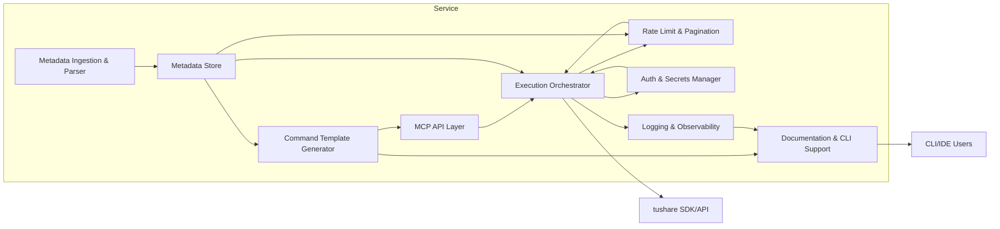

# Components

## Metadata Ingestion & Parser
- **Responsibility:** 解析 tushare SDK/文档，输出结构化元数据。
- **Key Interfaces:** `parse_sdk_interface()`, `refresh_metadata_cache()`。
- **Dependencies:** `Metadata Store`, `Field Alias Rules`。
- **Technology Stack:** Python 3.11, SQLModel, 校验脚本。

## Metadata Store
- **Responsibility:** 存储/版本化接口元数据与限频策略。
- **Key Interfaces:** `get_interface_metadata()`, `save_metadata()`。
- **Dependencies:** SQLite/SQLModel/Alembic。
- **Technology Stack:** SQLite 3.45 → PostgreSQL 16。

## Command Template Generator
- **Responsibility:** 基于元数据生成 MCP 指令文件与文档。
- **Key Interfaces:** `generate_command_template()`, `bulk_generate_templates()`。
- **Dependencies:** `Metadata Store`, Jinja2。
- **Technology Stack:** Python, Jinja2, Pydantic。

## MCP API Layer (FastAPI)
- **Responsibility:** 暴露 REST/CLI 接口，执行参数验证与响应格式化。
- **Key Interfaces:** `POST /mcp/execute`, `GET /mcp/commands`, `POST /auth/token`。
- **Dependencies:** `Auth & Secrets Manager`, `Execution Orchestrator`。
- **Technology Stack:** FastAPI, uvicorn, httpx。

## Execution Orchestrator
- **Responsibility:** 调度 tushare 调用，协调分页、限频、重试。
- **Key Interfaces:** `execute_command()`, `with_retry()`。
- **Dependencies:** `Command Template Store`, `Rate Limit Adapter`, `TokenCredential`, `Logging`。
- **Technology Stack:** Python asyncio, anyio。

## Rate Limit & Pagination Adapter
- **Responsibility:** 执行限频窗口管理、重试退避与分页遍历。
- **Key Interfaces:** `paginate_fetch()`, `enforce_rate_limit()`。
- **Dependencies:** `Execution Orchestrator`, `Metadata Store`。
- **Technology Stack:** 自研算法模块。

## Auth & Secrets Manager
- **Responsibility:** 加密/解密 tushare Token，提供轮换与审计。
- **Key Interfaces:** `store_token()`, `get_token()`, `rotate_token()`。
- **Dependencies:** `TokenCredential`, `cryptography`。
- **Technology Stack:** cryptography (Fernet), python-dotenv。

## Logging & Observability
- **Responsibility:** 记录结构化日志、导出指标。
- **Key Interfaces:** `log_execution()`, `emit_metrics()`。
- **Dependencies:** structlog, OpenTelemetry。
- **Technology Stack:** structlog 24.1, OTEL 1.25。

## Documentation & CLI Support
- **Responsibility:** 生成指令文档、提供 Typer CLI。
- **Key Interfaces:** `generate_docs_from_templates()`, CLI 命令 `list/describe/exec`。
- **Dependencies:** `Command Template Generator`, MkDocs, Typer。

## Component Diagram

