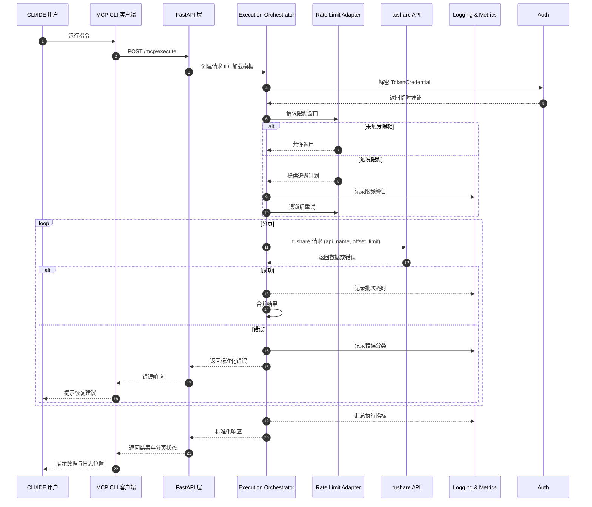

# Core Workflows

## 执行 MCP 指令获取行情数据

```mermaid
sequenceDiagram
    autonumber
    participant User as CLI/IDE 用户
    participant CLI as MCP CLI 客户端
    participant API as FastAPI 层
    participant Exec as Execution Orchestrator
    participant Rate as Rate Limit Adapter
    participant TS as tushare API
    participant Log as Logging & Metrics

    User->>CLI: 运行指令
    CLI->>API: POST /mcp/execute
    API->>Exec: 创建请求 ID, 加载模板
    Exec->>Auth: 解密 TokenCredential
    Auth-->>Exec: 返回临时凭证
    Exec->>Rate: 请求限频窗口
    alt 未触发限频
        Rate-->>Exec: 允许调用
    else 触发限频
        Rate-->>Exec: 提供退避计划
        Exec->>Log: 记录限频警告
        Exec->>Rate: 退避后重试
    end
    loop 分页
        Exec->>TS: tushare 请求 (api_name, offset, limit)
        TS-->>Exec: 返回数据或错误
        alt 成功
            Exec-->>Log: 记录批次耗时
            Exec->>Exec: 合并结果
        else 错误
            Exec->>Log: 记录错误分类
            Exec-->>API: 返回标准化错误
            API-->>CLI: 错误响应
            CLI-->>User: 提示恢复建议
        end
    end
    Exec-->>Log: 汇总执行指标
    Exec-->>API: 标准化响应
    API-->>CLI: 返回结果与分页状态
    CLI-->>User: 展示数据与日志位置
```
